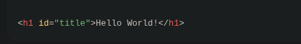
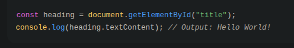
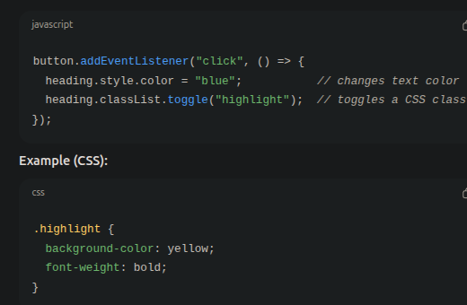
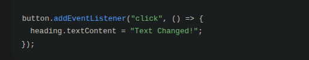
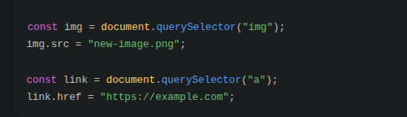
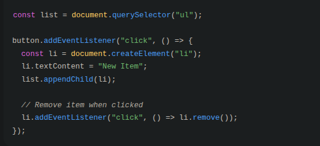
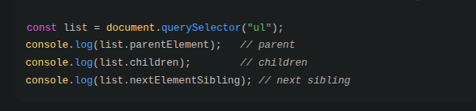

# 🌳 DOM Manipulation Basics

This lesson will teach you how to make web pages **dynamic and interactive** using JavaScript.

---

# 1️⃣ Understanding the DOM

The **Document Object Model (DOM)** is how the browser represents your webpage as a **tree of objects**.  
Each HTML element (like `
`, `
`, `<button>`) is a **node** that JavaScript can access and manipulate.

**Why it matters:** Without the DOM, JavaScript cannot interact with your webpage.

**Example:**

---

# 2️⃣ Reading & Updating Content

When you want to **change the text or HTML** inside an element, you can use:

- **`.textContent`** → gets or sets **all the text** inside an element (including hidden text).  
- **`.innerText`** → gets or sets **only the visible text**.  
- **`.innerHTML`** → gets or sets **everything inside the element**, including HTML tags.

**Why it matters:** These methods let you **dynamically change the content** of your page when users interact with it.

# Changing Styles & Classes

You can modify the appearance of elements dynamically.

**Example (JavaScript):**

Why it matters: Dynamically changing styles makes your page responsive to user actions, improving user experience.

# Adding Event Listeners

Event listeners let you make your page interactive by responding to user actions.

**Example**:

Why it matters: Without event listeners, your webpage is static and cannot respond to user input.

# Working with Attributes

You can read or change attributes like src, href, or data-* dynamically.

**Example:**

Why it matters: Changing attributes dynamically allows you to update images, links, or data values without reloading the page.

# Creating & Removing Elements

You can create new elements and remove existing ones dynamically.

Example:

Why it matters: Dynamically adding/removing elements allows your page to adapt content in real-time, making it more interactive.

# Traversing the DOM

You can navigate parent, child, and sibling elements to manipulate content or structure.

Example:

Why it matters: DOM traversal lets you find and manipulate related elements without needing multiple queries.