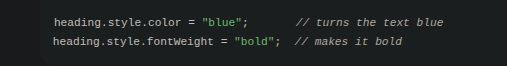
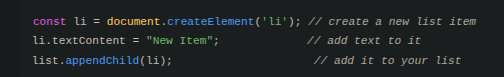
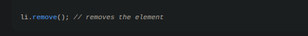
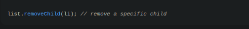

# 🌳 DOM Manipulation Lesson

In this lesson, you will learn how to **change content, styles, and structure dynamically** using JavaScript.

---

## 1️⃣ Modifying Content

Sometimes you want to **change the text or HTML** that the user sees. There are a few ways to do this:

- **`.textContent`** → changes just the text inside an element.  
  *Example: changing a heading without touching any HTML inside it.*

- **`.innerHTML`** → changes everything inside, including HTML tags.  
  *Example: adding bold or italic text dynamically.*

- **`.value`** → gets or sets the text inside input fields.  
  *Example: reading or updating an input box.*

const heading = document.querySelector('h1');
heading.textContent = "Hello, World!";

💡 Tip: Use .textContent if you just want plain text, and .innerHTML if you want formatting.

## 2️⃣ Modifying Styles

You can change how things look directly from JavaScript:

Inline styles: change a single property at a time:

CSS classes: easier for reusable styles:

💡 Tip: Use classes if you want consistent styling across many elements.

## 3️⃣ Creating Elements

Want to add new items or sections dynamically? You can make new elements with JavaScript:

appendChild adds it at the end.

insertBefore lets you add it somewhere specific.

💡 Think of it like building blocks — you’re creating a new block and putting it somewhere on your page.

## 4️⃣ Removing Elements

Sometimes you want to take something off the page:

Remove an element directly:

Or remove via the parent:

💡 Tip: Always know who the “parent” is when removing an element.